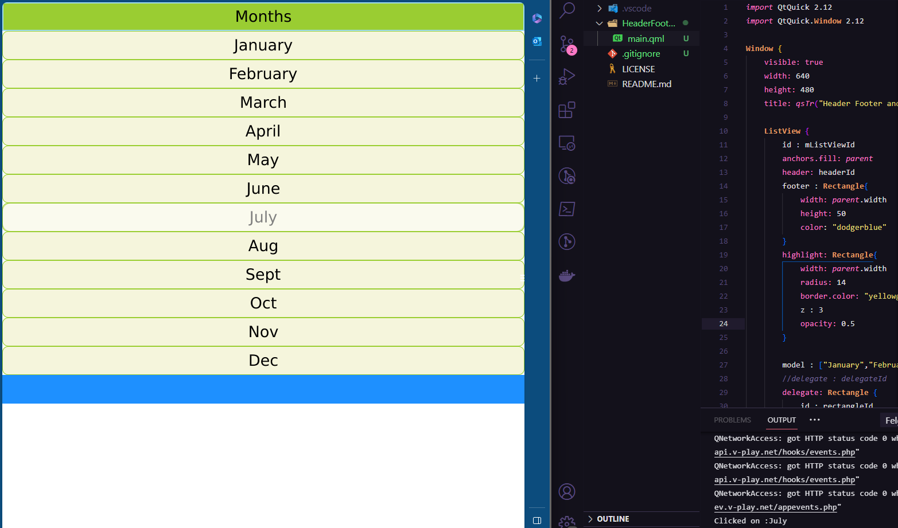

# QT & QML
Dedicated to my Qt experiments.

 Courses covered
---
  - Qt 5 QML For Beginners: The Fundamentals
  - Qt 5 QML Intermediate: Interfacing to C++
  - Qt 5 QML Advanced : Interfacing to C++

 Examples & tests
---
  All the code examples from the course and their respective tests were made using VSCode with ``QML Syntax/Tools`` extension from <a href='https://www.bing.com/videos/riverview/relatedvideo?q=qt%20config%20in%20vscode&mid=6DC9A7FC9B5ED849A9F86DC9A7FC9B5ED849A9F8&ajaxhist=0'>Felgo</a>, which runs the Qt app on browser and mobile, as shown by the images below. (This example is from the section 11 - Models, Views and delegates, topic 75 - Decorations: Headers, Footers and Highlights)

  

  

 Quick notes
---

- Anchors, grid, column (align items)
- Layout (fit to the size - grid, colunm, etc)
- Flow (wrap - adjust to width)

- Mouse Area (anchors.fill: parent)
- QtQuick Global Object
- Property bindings
- Properties and Handlers (onClick, onWidthChanged, etc)

- Signals (Observer Pattern)
- Slots (basicaly a function you CONNECT with a signal)

  - ``<signalComponentId>.<signal>connect(<slotComponentId>.<slot>)`` (root)
  - ``<componentSignal>.connect(<ComponentSlotId>.<slot>)`` (component)
  - wrap connection in the 'Notifier': ``target: receiverId``

- Custom COMPONENTS (button, row, etc)
  - Put the properties in 'Item' to make them visible and acces those props in ohter components 
  - The other props (wrapped in the components inside 'Item' are inaccessible)
  - ROW: Explicit the width and height of the subcomponents (to align correctly)

- JS in QML (attention to imports and includes)

- QT Quick Controls ('React' & UI for QT)
  - Components
  - Action

- Storage (states)
  - Settings (specify app identifiers - ``.cpp`` file)

- C++ with Qt
  - Context properties: expose C++ data to QML
  - Connections (a qml 'slot' can get a 'signal' from c++)
    - target: `<classExposedInMain.cpp>`
  - Q_PROPERTY
  - emit (when something changes it EMITS the 'signal' to the 'slot' change as well)

- QDebug ('console.log' for Qt)

- Expose data from C++ to QML
  - Context Property
  - Context Object
  - `qmlRegisterType<>()`

- Singletons (pattern)
  - Ensure that only one instance of the class exists
  - Recommended when data is changing on yhe C++ side and you want to be notified of the changes on the QtQuick side
  - In C++: `singletonProvider()`
  - In QML: `pragma Singleton`

- Shortcuts (on QT Creator)
  - Ctrl + I: indent (align)
  - F1: Help (description)
  - Help Icon on the sidebar (docs - type the name of the feature)

---

#### Always check the official docs!

<b><a href='https://doc.qt.io/qt-5'>Qt5</a></b> |
<b><a href='https://doc.qt.io/qt-6'>Qt6</a></b>
