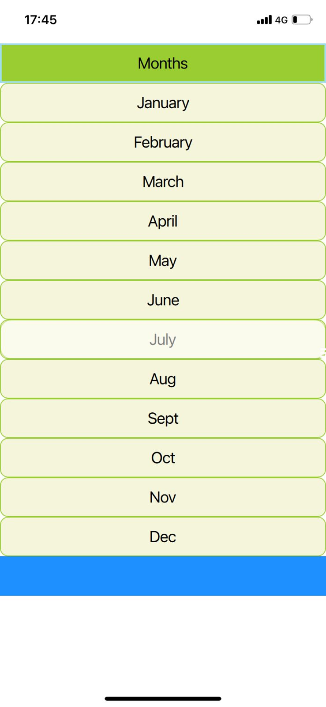

# QT & QML
Dedicated to my Qt5 experiments.

### Courses covered
  - Qt 5 QML For Beginners: The Fundamentals
  - Qt 5 QML Intermediate: Interfacing to C++
  - Qt 5 QML Advanced : Interfacing to C++

### Examples & tests
  All the code examples from the course and their respective tests were made using VSCode with ``QML Syntax/Tools`` extension from <a href='https://www.bing.com/videos/riverview/relatedvideo?q=qt%20config%20in%20vscode&mid=6DC9A7FC9B5ED849A9F86DC9A7FC9B5ED849A9F8&ajaxhist=0'>Felgo</a>, which runs the Qt app on browser and mobile, as shown by the images below. (This example is from the section 11 - Models, Views and delegates, topic 75 - Decorations: Headers, Footers and Highlights)

   

  

### Quick notes

- Anchors, grid, column (align items)
- Layout (fit to the size - grid, colunm, etc)
- Flow (wrap - adjust to width)

- Mouse Area (anchors.fill: parent)
- QtQuick Global Object
- Property bindings
- Properties and Handlers (onClick, onWidthChanged, etc)

- Signals (Observer Pattern)
- Slots (basicaly a function you CONNECT with a signal)

  - ``<signalComponentId>.<signal>connect(<slotComponentId>.<slot>)`` (root)
  - ``<componentSignal>.connect(<ComponentSlotId>.<slot>)`` (component)
  - wrap connection in the 'Notifier': ``target: receiverId``

- Custom COMPONENTS (button, row, etc)
  - Put the properties in 'Item' to make them visible and acces those props in ohter components 
  - The other props (wrapped in the components inside 'Item' are inaccessible)
  - ROW: Explicit the width and height of the subcomponents (to align correctly)

- JS in QML (attention to imports and includes)

- QT Quick Controls ('React' & UI for QT)
  - Components
  - Action

- Shortcuts(on QT Creator)
  - Ctrl + I: indent (align)
  - F1: Help (description)
  - Help Icon on the sidebar (docs - type the name of the feature)
